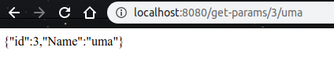

### springboot-rest-api

------

springboot-rest-api explains how to write rest API's using spring boot framework. spring boot is java based framework which is used for developing web applications and desktop applications and to write microservices.

It also contains information about how use logger in spring boot application and how to deploy spring boot application using docker.

#### Usage:

------

```
https://github.com/UmaMaheswari248/springboot-rest-api.git
cd springboot-rest-api
```

#### Running Application 

```
java -jar springboot-rest-api-1.0.0.jar
```

Now spring boot application is running on apache tomcat server.

Default port for tomcat server is 8080 .The application is running on that port only.

#### Running Application Using Docker

If we want to run spring boot application using docker we need docker file. docker file is present in root folder. now we need to build docker image using docker .

```
#building docker image using docker build command
docker build -t springboot-rest-api:app .
```

The above command will generate docker image

After docker image built we need to run docker container.

```
#Running docker container using docker run command
docker run -p 8080:8080 --name springboot-rest-api springboot-rest-api:app
```

Now spring boot application is running on 8080 port.

#### Testing Application

#### GET METHOD:

------

Writing GET method in spring boot:

```
@RequestMapping("/test")
	public String testing() {
		return "testing GET method";
	}
```

If we haven't give any method it will take method as GET method.

API Response:


##### GET METHOD WITH PASSING PARAMETERS:

------

Code for GET method with parameters:

```
@RequestMapping("/get-params/{id}/{name}")
	public String get_params(@PathVariable("id") int id,@PathVariable("name") String name) {
		JSONObject json=new JSONObject();
		json.put("id", id);
		json.put("Name", name);
		logger.info("parameters"+id+""+name);
		return json.toString();
	}
```

API Response:



This API returns json response with same values as we have sent in parameters.


#### POST METHOD:

------

Code for POST method :

```
@RequestMapping(value="/test-post",method=RequestMethod.POST)
	public String testing_post() {
		return "testing POST method";
	}
```

For POST method we should kept method as POST method.

API Response:


#### POST METHOD WITH JSON REQUEST:

Code for POST with json request:

```
	@RequestMapping(value="/post-request",method=RequestMethod.POST)
	public String get_params(@RequestBody String jsonString) {
		JSONObject json=new JSONObject(jsonString);	
		return json.toString();
	}
```

API Response:


### Contribution:

------

Contributions in any form are welcome. You can contribute by reporting issues, submitting pull requests, reviewing pull requests, participating in discussions on issues and pull requests and more.